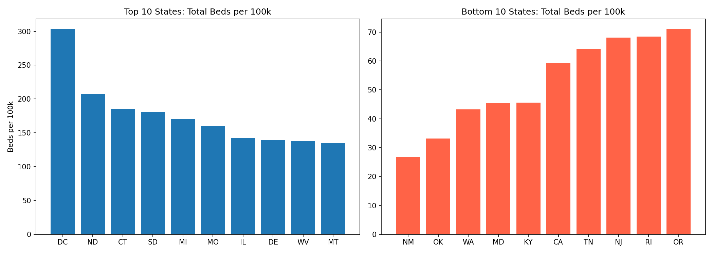
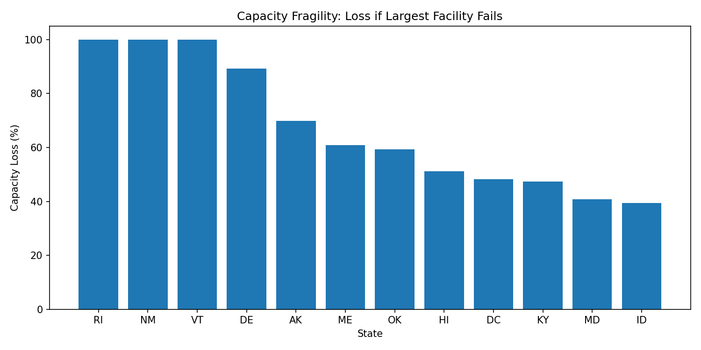

## Challenge Area: Equitable Access

### Coverage status

**Completed with current available datasets (state-level).**

### Objective

Identify where trauma and burn capacity is unevenly distributed and quantify fairness using population-adjusted indicators.

### Datasets used

- Main source: `data/NIRD 20230130 Database_Hackathon.csv`
- Population denominator: `data/external/state_population_2012.csv` (derived from US Census state population data)
- Rurality context: `data/external/rucc_2023_county.csv` (USDA ERS)
- Broadband context (for equity-digital overlap): `data/external/state_broadband_acs2022.csv` (ACS API)

### Method

1. Clean capability and bed fields using `src/data_loading.py`.
2. Aggregate to state-level metrics:
   - facility count
   - trauma/burn capability counts
   - `total_beds`, `burn_beds`
3. Join state population and compute:
   - `total_beds_per_100k`
   - `burn_beds_per_100k`
4. Add resilience metric:
   - `% capacity loss if largest facility in state is unavailable`

Pipeline file: `src/challenge_pipeline.py`  
Output table: `outputs/equitable_access_state_metrics.csv`

### Key outputs

- Highest per-capita bed availability includes DC, ND, CT.
- Lowest per-capita bed availability includes NM, OK, WA.
- Several states have moderate total capacity but high fragility due to concentration.

### Visual evidence

### Recommended action

- Prioritize lower per-capita states for additional trauma/burn access interventions.
- In high-fragility states, add redundancy planning for major hub disruption scenarios.
