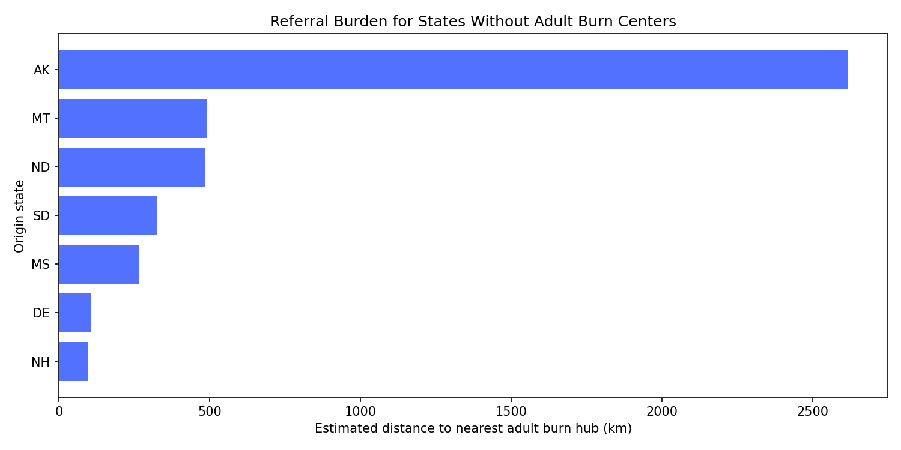

## Challenge Area: Referral Networks

### Coverage status

**Completed at state-level referral strategy**, focused on burn-referral dependency where gaps are largest.

### Objective

Identify states that likely require out-of-state referral and assign nearest capable hub states to reduce transfer delays.

### Datasets used

- Main source: `data/NIRD 20230130 Database_Hackathon.csv`
- State boundaries and centroids: `data/external/cb_2023_us_state_20m/cb_2023_us_state_20m.shp` (US Census TIGER cartographic boundaries)

### Method

1. Compute state capability counts (adult trauma and adult burn centers).
2. Identify referral-dependent states:
   - states with `adult_burn_centers == 0`
3. Build hub set:
   - states with `adult_burn_centers > 0`
4. Compute centroid-to-centroid distance between each dependent state and candidate hubs.
5. Select nearest hub as recommended destination.

Pipeline file: `src/challenge_pipeline.py`  
Output table: `outputs/referral_network_recommendations.csv`

### Key outputs

Referral burden highlights include:

- Alaska -> Washington (~2617 km)
- Montana -> Idaho (~489 km)
- North Dakota -> Minnesota (~486 km)
- South Dakota -> Nebraska (~325 km)

These are strong candidates for formalized interstate burn referral agreements and tele-consult backup.

### Visual evidence

### Recommended action

- Establish formal referral pathways for highest-distance states first.
- Add emergency transfer surge protocols for long-distance dependency corridors.
- Pair burn referral pathways with telemedicine pre-transfer specialist consults.
