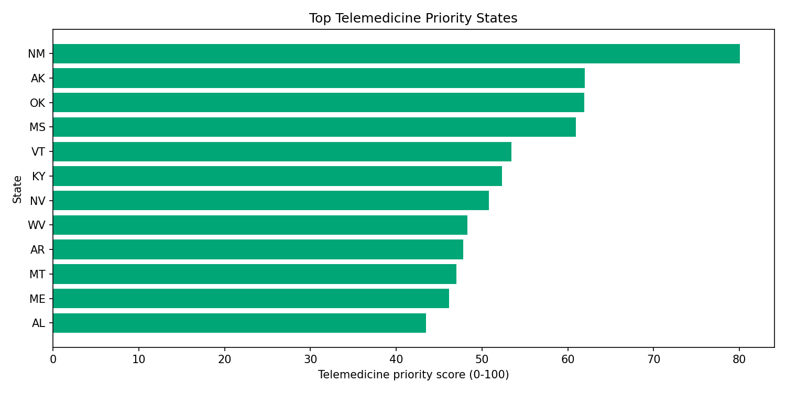

## Challenge Area: Telemedicine

### Coverage status

**Completed for deployment prioritization at state level.**

### Objective

Rank states by likely telemedicine impact using a combined readiness-and-need score.

### Datasets used

- Main source: `data/NIRD 20230130 Database_Hackathon.csv`
- Mobile broadband coverage: `data/external/bdc_us_mobile_broadband_summary_by_geography_J25_03mar2026/bdc_us_mobile_broadband_summary_by_geography_J25_03mar2026.csv` (FCC BDC)
- Broadband subscription fallback: `data/external/state_broadband_acs2022.csv` (US Census ACS API)
- Rurality: `data/external/rucc_2023_county.csv` (USDA RUCC 2023)
- Social vulnerability: `data/external/SVI_2022_US_county.csv` (CDC/ATSDR SVI 2022)
- Population: `data/external/state_population_2012.csv`
- Provider supply context: `data/external/AHRF_2024-2025_CSV/NCHWA-2024-2025+AHRF+COUNTY+CSV/AHRF2025hp.csv`

### Method

Construct `telemedicine_priority_score` (0-100) from weighted components:

- 25% access gap component (inverse of `total_beds_per_100k`)
- 15% fragility component (`capacity_loss_pct`)
- 15% rurality component (`rural_county_share`)
- 15% digital gap component (`100 - digital_coverage_pct`, with ACS fallback)
- 15% provider shortage component (inverse of AHRF primary care physician density)
- 15% vulnerability component (`svi_weighted`)

All components are min-max normalized before weighting.

Pipeline file: `src/challenge_pipeline.py`  
Output table: `outputs/telemedicine_priority_state_scores.csv`

### Key outputs

Top priority states in current run include:

- New Mexico
- Alaska
- Oklahoma
- Mississippi
- Vermont
- Kentucky

These states combine low access and/or high fragility with rurality and broadband constraints.

### Visual evidence

### Recommended action

- Start pilot deployment in highest-score states.
- Use tele-consult for trauma/burn triage and pre-transfer specialist review.
- Track transfer avoidance and time-to-specialist as first success metrics.
