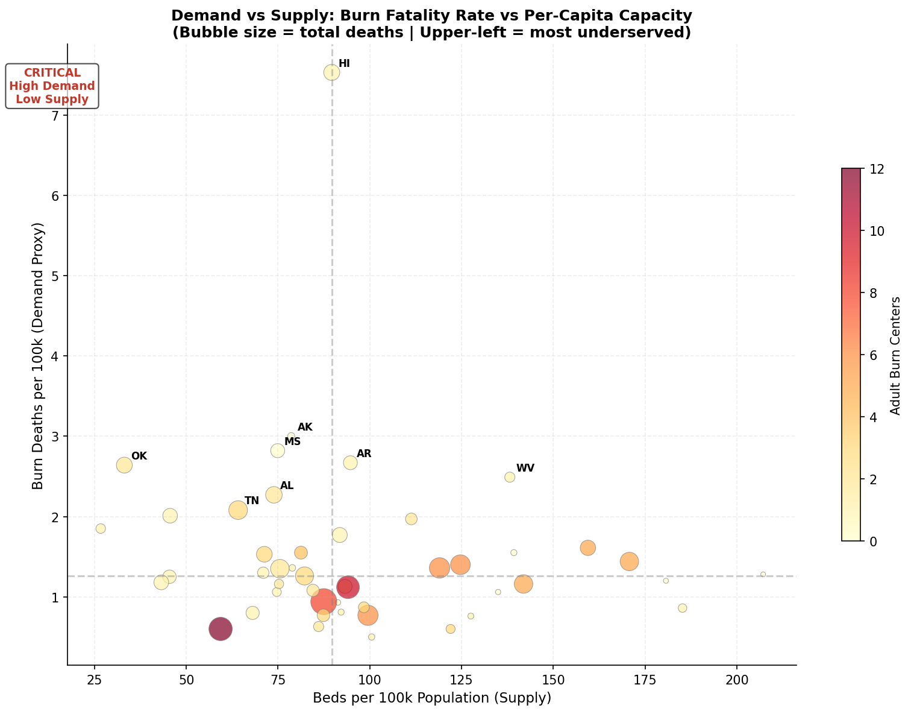
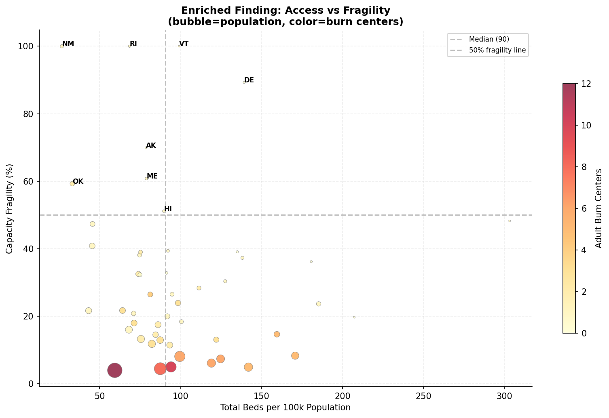
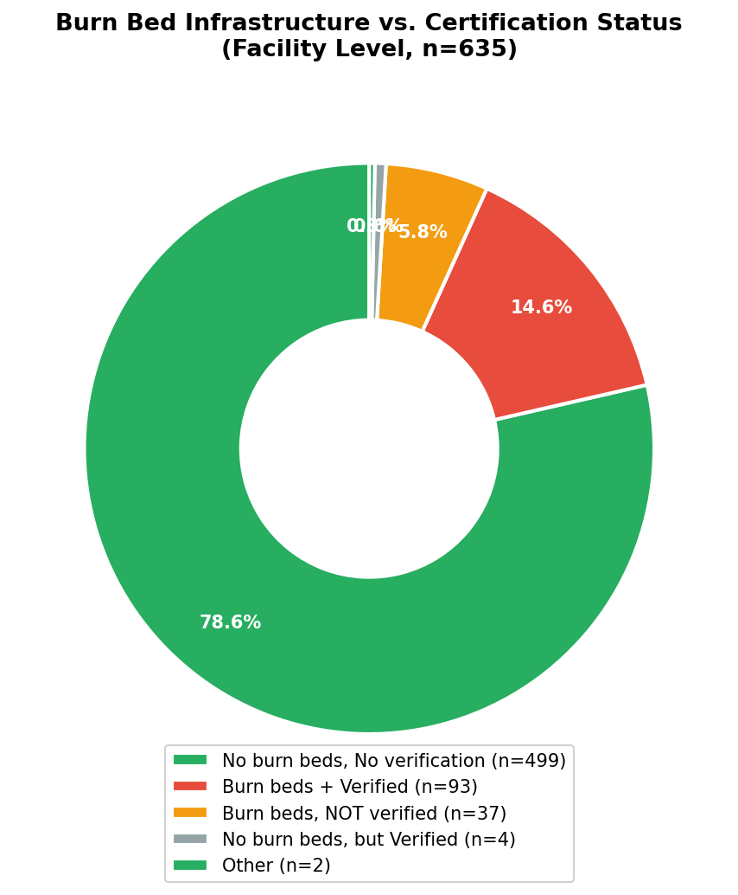
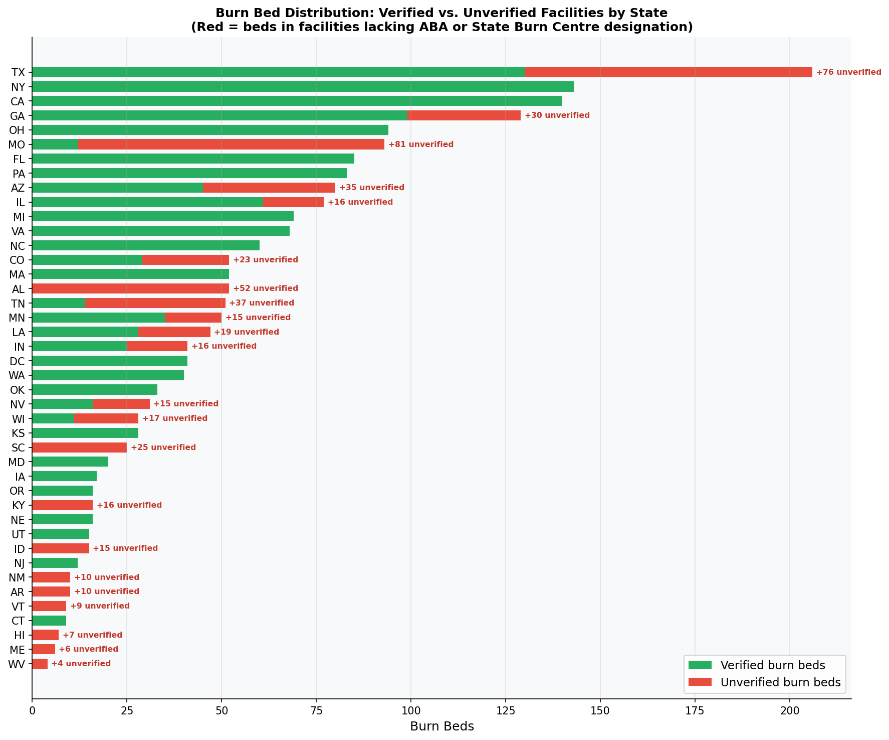
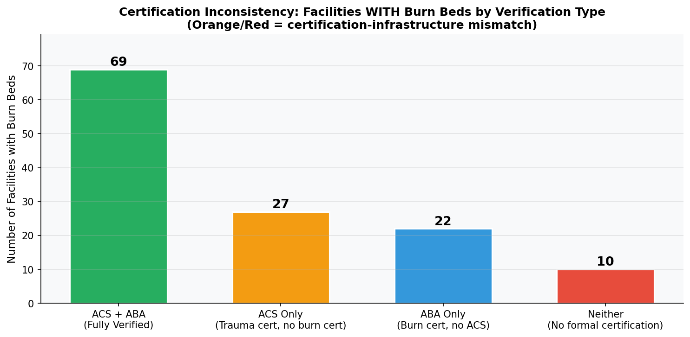
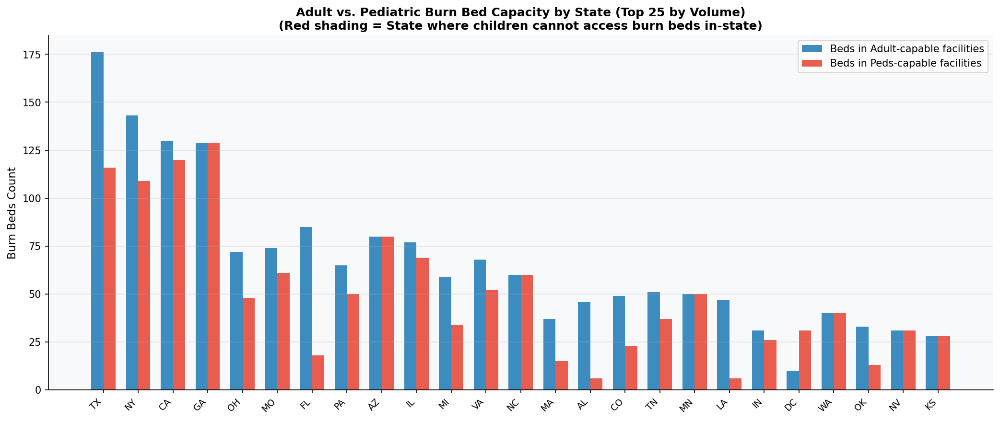

# Equitable Access to Burn & Trauma Care
## A Data-Driven Analysis of Infrastructure Gaps, Certification Inconsistencies & Referral Delays
### Hackathon Presentation | March 2026

---

## Slide 1: The Problem — What's Actually Broken

> *"Time is tissue."* — American Burn Association

**~4,000 Americans die from burn injuries each year.** Survival depends on reaching a **qualified burn-care facility** within hours. But two structural failures hide inside the system:

- 🔴 **Supply Gap** — burn and trauma capacity is unequally distributed across states  
- 🔴 **Infrastructure & Certification Fragmentation** — burn beds, capability designation, and formal verification are three separate systems that frequently **contradict each other**

The result is that the burn-care system appears more capable than it is. Referral systems direct patients to facilities that are:
- Verified but **have no burn beds**
- Stocked with burn beds but **not burn-certified**
- Adult-capable burn facilities where **no child can be treated**

> This is a structural design failure — not just a resource shortage.

---

## Slide 2: Our Chosen Focus Areas

We focussed on three dimensions of inequity — moving from label to infrastructure to certification:

| Dimension | Why It Matters |
|-----------|---------------|
| **Per-capita burn bed & trauma capacity** | Population-adjusted supply reveals gaps hidden by raw counts |
| **Burn bed infrastructure vs. certification alignment** | Are the beds in the right facilities? Are those facilities verified? |
| **Adult vs. Pediatric capability at the bed level** | A burn-capable facility for adults ≠ a burn-capable facility for children |

**Geographic spotlight states:**
- 🔴 **Alaska** — 2,617 km to nearest adult burn hub; no burn beds
- 🔴 **Missouri** — most unverified burn beds (81); appears "covered" but isn't
- 🔴 **Mississippi, Montana, SD, ND, NH, DE** — zero burn beds at all
- 🟡 **TX, TN, AL, CO, IN, LA** — significant unverified burn bed inventory

---

## Slide 3: The Datasets

| Dataset | Source | What It Provides |
|---------|--------|-----------------|
| **NIRD 2023** (635 facilities) | ABA / ACS | Core supply: BURN_BEDS, BURN_ADULT, BURN_PEDS, ACS_VERIFIED, ABA_VERIFIED, BC_STATE_DESIGNATED |
| **CDC WISQARS 2023** | CDC | Demand: burn fatality rates per state (4,001 deaths total) |
| **US Census 2012 Population** | US Census | Per-capita denominators |
| **USDA RUCC 2023** | USDA ERS | Rural county classification |
| **ACS Broadband 2022** | US Census | Digital access for telemedicine scoring |
| **CB 2023 State Shapefiles** | Census TIGER | Referral distance geometry |

**Key analytical outputs:**
- `outputs/burn_infrastructure_scorecard.csv` — per-state scorecard: burn beds × ABA/ACS verification × age coverage
- `outputs/burn_bed_age_mismatch.csv` — burn beds split by adult-capable vs peds-capable facilities per state

---

## Slide 4: Key Finding 1 — Supply-Demand Mismatch (State Level)

### High burn death rates ≠ high burn-care supply

4,001 US burn deaths in 2023, with a **15× variation** in crude rates (0.50 Utah → 7.53 Hawaii). When plotted against beds per 100k population:

- **Upper-left** (high deaths, low beds): Oklahoma (2.64/100k, 33.1 beds/100k), Alaska (3.00, 78.6), Mississippi (2.82, 71.2)
- **Lower-right** (low deaths, high beds): DC, Nebraska, North Dakota

**The 6 Critical states** (< 50 beds/100k):

| State | Beds/100k | Burn Death Rate |
|-------|-----------|----------------|
| New Mexico | 26.7 | Low (data gap) |
| Oklahoma | 33.1 | **2.64/100k** |
| Washington | 43.2 | Low |
| Maryland | 45.4 | Moderate |
| Kentucky | 45.6 | **2.01/100k** |

**~15.5 million Americans** live in these Critical-tier states.

---

## Slide 5: Key Finding 1b — The "False Adequacy" Trap in Capacity Fragility

### States that look well-served are one closure away from zero

**Capacity fragility** = % of a state's burn/trauma beds held by its single largest facility:

| State | Beds/100k | Fragility | Actual risk |
|-------|-----------|-----------|-------------|
| New Mexico | 26.7 | **100%** | One facility = entire state |
| Rhode Island | 68.5 | **100%** | ABA-verified but reports **zero burn beds** |
| Vermont | 99.0 | **100%** | 100% fragility + only 9 burn beds, **unverified** |
| Delaware | 139.3 | 89% | Appears strong — no burn beds at all |

> Rhode Island illustrates the verified-without-infrastructure anomaly: it holds ABA designation but records **zero burn beds** in NIRD. The credential is present; the infrastructure may not be.

---

## Slide 6: Key Finding 2 — The Burn Bed vs. Certification Mismatch

### 534 burn beds sit outside any formal quality framework

Of the 635 NIRD facilities, only **136** have any burn beds. Of those 136:

| Category | Facilities | Burn Beds |
|----------|-----------|-----------|
| Burn beds + ABA/State verified | ~80 | ~1,620 |
| **Burn beds, NOT verified (ABA or State)** | **~56** | **534** |
| ABA/State verified but zero burn beds | Several | 0 |

**534 burn beds — ~25% of all US burn bed capacity — are in facilities with no specific burn certification.**

These beds are invisible to official referral networks (which filter for verified facilities), but will receive overflow patients during surge events — without ABA-standard wound care, infection control, or specialist staffing.

**Worst states by unverified burn bed volume:**
Missouri (81), Texas (76), Alabama (52), Tennessee (37), South Carolina (25)

In Missouri alone, **87% of burn beds sit in unverified facilities.**

---

## Slide 7: Key Finding 2b — ACS ≠ ABA: The Certification Inconsistency

### A trauma-verified hospital is not a burn-verified hospital

ACS (trauma) and ABA (burn) run **parallel, non-interchangeable** accreditation tracks. A facility can be ACS-verified and hold burn beds without ever having undergone a burn-specific quality review.

**Of facilities WITH burn beds:**
- **ACS-only** (no burn cert): A significant cohort — trauma-reviewed, burn-unreviewed
- **Neither ACS nor ABA**: Some hold burn beds with no formal accreditation at all
- **Both ACS + ABA/State**: The minority with fully consistent credentialling

**The referral chain consequence:** An ER physician searching for bed availability finds a nearby ACS-verified hospital with beds — routes the patient — only for the patient to arrive at a facility without ABA-trained burn teams, appropriate wound-care supplies, or burn-outcome monitoring.

**The adult vs peds infrastructure gap:**

States shaded in red have adult burn beds but zero pediatric-capable burn beds. For a burned child, the existence of adult burn beds in their state is meaningless.

---

## Slide 8: Root Cause Analysis

### Why do beds, flags, and certifications fail to align?

| Root Cause | Data Evidence |
|-----------|---------------|
| **Three separate credentialling tracks** (ACS, ABA, state) operating independently — no joint audit requirement | 534 unverified burn beds; ACS-only facilities holding burn infrastructure |
| **Verified-without-infrastructure anomaly** — ABA designation persists after bed reduction or decommissioning | RI: ABA-verified, 0 burn beds recorded |
| **Flags ≠ beds** — capability flags can be set without dedicated physical burn beds | Facilities with `BURN_ADULT=True` and `BURN_BEDS=0` |
| **Age mismatch in infrastructure** — adult and peds burn care are not co-located; physical beds for children absent in multiple states | 12 states with no peds-capable burn beds |
| **Volume threshold problem** — ABA accreditation requires case throughput; rural or low-volume states cannot maintain it | States with 0% verified burn beds are small-volume states |
| **Referral engines ignore infrastructure** — algorithms route to "nearest burn centre" without checking bed count, verification status, or age suitability | NH → VT chain failure: unverified beds + Adult-Only gap at the destination |

---

## Slide 9: Solutions — Two Tracks for Two Findings

### Finding 1: Supply-Demand Gap → Invest and Mandate

**Immediate (0–12 months):**
- 🎯 Direct HRSA Trauma Systems Program grants to 6 Critical-tier states (NM, OK, WA, MD, KY, AK)
- 📡 Deploy burn-specific telemedicine consult protocols in the 8 no-burn-bed states — ABA-certified remote guidance during the referral window compresses effective delay
- 🔧 Fix referral chain failure NH → VT now: redirect peds patients to Boston Children's Hospital

**Long-term (18–36 months):**
- 🏥 Fund verified burn bed expansion (adult + peds) in fragility states (NM, RI, VT)
- 📊 Mandate annual per-capita burn bed adequacy reporting in Medicare/Medicaid network standards

### Finding 2: Infrastructure-Certification Mismatch → Align and Audit

**Immediate (0–6 months):**
- ⚠️ Update all referral directories to filter by: (a) age-appropriate capability flag, (b) ABA or state designation, and (c) minimum recorded burn beds > 0
- ✂️ Remove from paediatric burn referral lists any facility with 0 burn beds or 0% verification coverage

**Medium-term (12–36 months):**
- 📋 Mandate ABA verification review for any facility with ≥ 5 burn beds holding ACS-only certification — non-compliant facilities removed from burn referral directories within 24 months
- 🏥 Fund paediatric burn unit designation (min 4 beds + ABA verification) in the 5 Adult-Only Gap states: CT, KY, ME, VT, WV
- 🤝 Require joint ACS + ABA audit for any new facility seeking both trauma and burn designation

---

## Slide 10: Summary & Call to Action

### Three Layers of Failure, Three Tiers of Fix

| Problem Layer | Scale | Key Fix |
|--------------|-------|---------|
| **Supply-demand gap** | 6 Critical states, 15.5M Americans | HRSA grants + telemedicine protocols |
| **534 unverified burn beds** | 22 states | Mandate ABA review or remove from referral lists |
| **8 states with zero burn beds** | AK, DE, MS, MT, ND, NH, RI, SD | Telemedicine + verified transfer agreements |
| **12 states with no peds burn beds** | Children in 12 states | Fund peds burn units in 5 Adult-Only states |
| **Referral chain failure (NH→VT)** | Affects peds patients | Age-aware routing fix — zero cost, immediate |

### The Three Actions That Would Save the Most Lives

> **1. Update referral directories to filter by age-appropriateness, ABA verification, and recorded burn bed count** — fixes the mismatch at the point of care, zero capital required, 0–6 months.
>
> **2. Mandate ABA verification for the 56 facilities that have burn beds but no burn certification** — closes the quality gap for 534 beds, 12–24 months.
>
> **3. Fund verified paediatric burn units in CT, KY, ME, VT, WV** — eliminates out-of-state referral requirement for children in 5 states, 18–36 months.

**The data exists. The gaps are quantified. The system just needs to enforce what it already requires on paper.**

---

*Data: ABA/ACS NIRD 2023 • CDC WISQARS 2023 • US Census 2012 • USDA ERS RUCC 2023*
*Pipelines: `src/challenge_pipeline.py` | `scripts/analyze_mismatch_full.py` | `scripts/analyze_infrastructure.py`*
